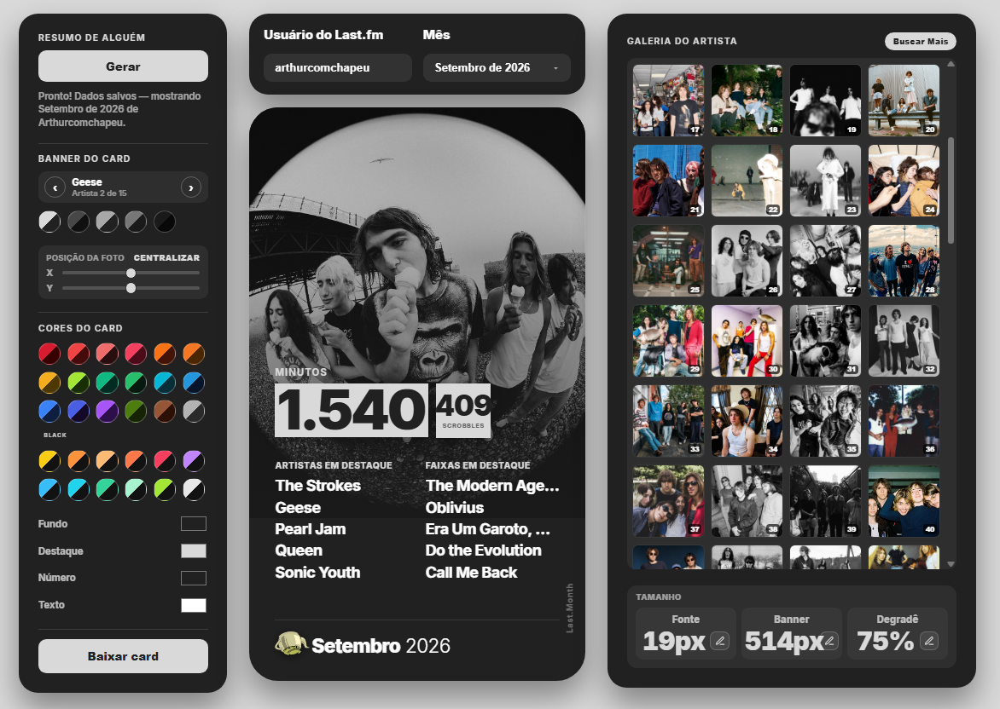

# Hatcharts

### Personalize sua experiência mensal do Last.fm gratuitamente.

O **Hatcharts** transforma suas estatísticas mensais do Last.fm em um card personalizado, permitindo escolher cores, imagens, artistas e outros detalhes visuais.

  
  

  <table>
    <tr>
      <td align="center">
        
      </td>
      <td align="center" width="25">
        
      </td>
      <td align="center">
        
      </td>
    </tr>
  </table>

> **Importante:** Interface própria para computador e celular.

### Como usar?

- Basta inserir seu usuário e clicar em gerar.
- Personalize seu card da forma que quiser.
- Explore todas as funcionalidades, a paleta automática e milhares de fotos disponíveis no banco de dados do Last.fm.
- Por último, baixe seu querido card e compartilhe em todas as suas redes.

> Ainda penso em criar diversos outros sites com base no Last.fm. Vejo muitas ferramentas por aí e sinto que unificar todas elas em um só lugar seria de enorme ajuda.

  

Desenvolvido por **HatCopied**.
